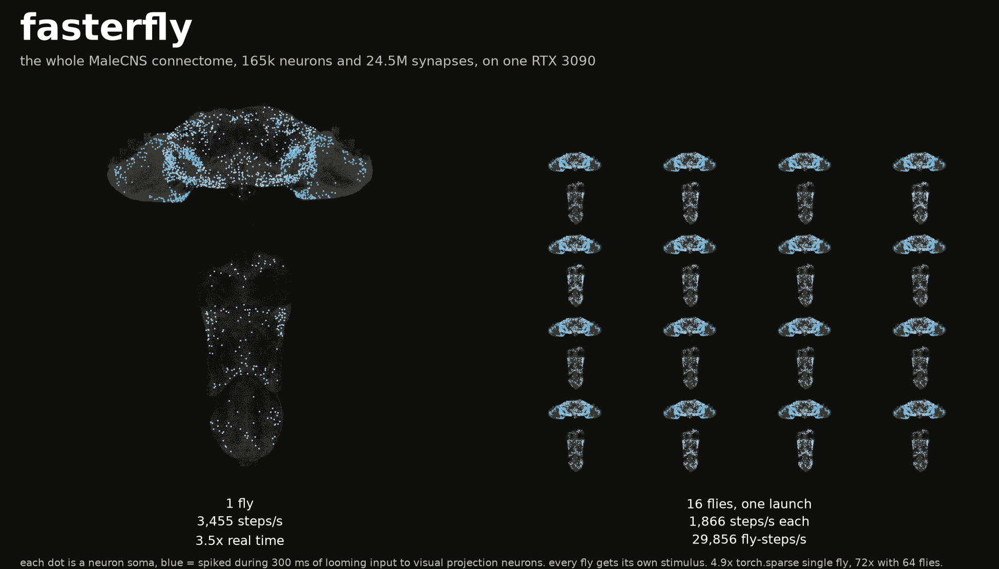
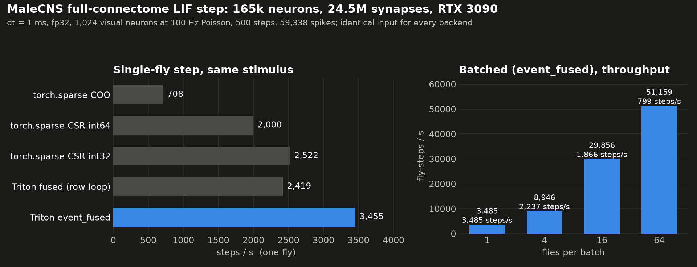

# fasterfly

The whole MaleCNS fly connectome, 165k neurons and 24.5M synapses, stepping at 3,455 Hz on one RTX 3090. Or 64 flies at once at 51k fly-steps/s. Same input, same spikes as `torch.sparse`, 4.9x to 72x faster.



## Single fly vs many flies, concretely

**One fly, real time.** Membrane time step is 1 ms. `torch.sparse` COO does 708 steps/s, so one second of fly life takes 1.4 s of wall clock. fasterfly does 3,455 steps/s: one second of fly life in 0.29 s, 3.5x faster than real time. That is the number that matters if you are driving a fly in a game or a robot and need the brain to keep up with the world.

**Many flies, throughput.** Put 16 flies in one batch and each step now takes 0.54 ms instead of 0.29, but it advances all 16. That is 29,856 fly-steps/s: 16 flies each living a second in 0.54 s of wall clock. With 64 flies it is 51,159 fly-steps/s, 72x what COO gives you for one. That is the number that matters if you are training a readout, sweeping parameters, or running many episodes.

Batching does not make one fly faster. It makes the GPU stop wasting the launch.

| | steps/s | wall clock per fly-second | vs torch.sparse COO |
|---|---|---|---|
| COO, 1 fly | 708 | 1.41 s | 1x |
| fasterfly, 1 fly | 3,485 | 0.29 s | 4.9x |
| fasterfly, 16 flies | 1,866 (x16) | 0.034 s | 42x |
| fasterfly, 64 flies | 799 (x64) | 0.020 s | 72x |

## Why it is faster

At any given millisecond fewer than 200 of the 165k neurons fire, but a sparse matmul still walks all 24.5M synapses. So instead: one Triton program per presynaptic neuron, silent ones exit right away, fired ones `atomic_add` their weights into the postsynaptic current. A second kernel does the LIF update. That alone is 4.9x.

Batching is the bigger win. Add a fly dimension to the state and the same launch serves N flies almost for free, because the cost was launch overhead, not synapses.

The kernel doesn't know it's a fly. Any big sparse signed graph with ~0.1-1% activity per step will see the same numbers.



## Numbers (RTX 3090, dt = 1 ms, fp32)

Same stimulus for every backend: 1,024 visual-projection neurons driven at 100 Hz
Poisson, 500 steps, 59,338 spikes total (~0.07% of neurons per step).

| Backend, single fly | steps/s | vs COO |
|---|---|---|
| torch.sparse COO (`torch.sparse.mm`) | 708 | 1x |
| torch.sparse CSR int64 | ~2,000 | 2.8x |
| torch.sparse CSR int32 | 2,522 | 3.6x |
| Triton fused, one program per row | 2,419 | 3.4x |
| Triton event_fused (scatter + LIF) | 3,455 | 4.9x |
| Triton event_fused_batched, N=1 | 3,485 | 4.9x |

fp16 values and CUDA graph capture add nothing on top of CSR int32. At 10x stimulus
(0.98% neurons per step) event_fused still gives 3,391 steps/s: the cost is launching
165k programs plus the elementwise LIF kernel, not the synapses.

### Batched over flies

State is `[n_neurons, n_flies]`, fly index contiguous. One scatter program per
(presynaptic neuron, tile of `fly_block` flies); a 2D `atomic_add` on `cur[col, fly]`
coalesces over flies and is masked by which flies fired, so flies never mix. Programs
whose tile is silent return immediately.

| n_flies | steps/s | fly-steps/s | vs COO single fly |
|---|---|---|---|
| 1 | 3,485 | 3,485 | 4.9x |
| 4 | 2,237 | 8,946 | 12.6x |
| 16 | 1,866 | 29,856 | 42x |
| 64 | 799 | 51,159 | 72x |

Batching raises throughput (parameter sweeps, readout training on many episodes),
not the latency of one fly.

## Validation

* `A·s` against `torch.mv` on adversarial spike vectors (all ones, top-1000 out-degree,
  1%, 50%): all allclose.
* 500-step raster bit-identical to CSR on the validation seed; N=1 batched bit-identical
  to `event_fused` and to CSR.
* Batch isolation: fly k in a batch of N is bit-identical to fly k alone, for N in
  {4, 16, 64}, with identical or per-fly stimuli.
* Not achievable: bit-identity with cuSPARSE for every seed. Atomic summation order
  differs, and a 1-ulp threshold tie (seed 13: neuron 60339, step 242, v = 1.000000119
  against v_th = 1.0) flips one spike and the chaotic network diverges afterwards. Each
  backend is deterministic run to run. Cross-backend bit-identity would need a
  deterministic gather kernel.

Full logs and per-run JSON: `runs/event_kernel/`, `runs/batched/`.

## Files

| File | What |
|---|---|
| `event_lif.py` | `EventFusedLIF`: Triton scatter kernel + LIF kernel, batched, reusable |
| `fast_step.py` | Benchmark and validation of every backend on one stimulus |
| `docs/hero.py`, `docs/step_speed.py` | Figures, numbers and knobs in the JSON next to each |
| `fast_params.json` | Benchmark knobs: variants, steps, stimulus, `n_flies` list, kernel blocks |
| `build_graph.py` | MaleCNS release tables → signed CSR (`cache/connectome_signed.npz`) + `cache/meta.parquet` |
| `params.json` | Data paths, graph filters, neurotransmitter signs, LIF constants |

## Run

```
python -m venv venv && ./venv/bin/pip install -r requirements.txt
# MaleCNS v1.0 feather tables in data/v1.0/ (see params.json "data")
./venv/bin/python build_graph.py
./venv/bin/python fast_step.py
```

Use `EventFusedLIF` directly:

```python
from event_lif import EventFusedLIF
lif = EventFusedLIF(M_csr, lif_params, device, block=128, fly_block=16)
v, s = lif.step(v, s, ext)   # all [n_neurons, n_flies] float32 contiguous
```

## Scope and limits

The kernel is generic: any sparse signed graph with low per-step activity. The regime
where it wins is what matters (large n, ~0.1-1% firing); dense or highly active graphs
are better served by cuSPARSE, and much smaller graphs by CUDA graph capture. LIF
constants are dimensionless (not Shiu et al. 2024). Ceiling for single-fly latency with
further work (fired-neuron compaction, CUDA graph over the launches) is launch latency,
~50-100k steps/s theoretical.

Versions measured: torch 2.6.0+cu124, triton 3.2.0.
